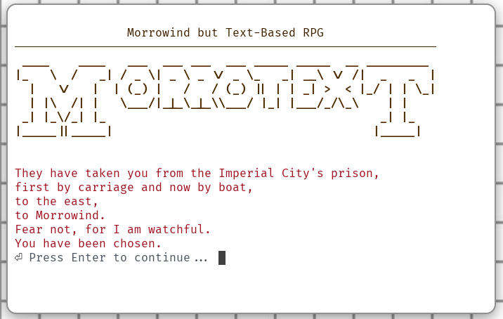
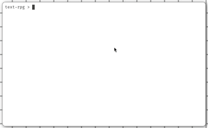

# Morrotext - A Text-Based RPG

<!--  -->

Morrotext is a command-line role-playing game built with Node.js and TypeScript that brings the Morrowind experience to your terminal. Featuring quests, turn-based combat, and a handcrafted world to explore.

## Features

- 🧙 **Three Playable Classes**: Warrior, Mage, and Cleric with unique abilities
- 🗺️ **Handcrafted World**: Explore four locations — a town, temple, forest, and ruins
- ⚔️ **Turn-Based Combat**: Battle goblins, skeletons, and void cultists
- 📜 **Quest System**: Accept and complete quests with objectives and rewards
- 🛠️ **Economy**: Buy and sell items with NPCs via a barter system
- 🎒 **Inventory System**: Equip weapons, armor, and accessories
- 🌟 **Character Progression**: Gain experience, level up, and increase your max HP
- 🤝 **NPC Interactions**: Scripted dialogue with quest- and inventory-aware options

## Installation

1. Ensure you have [Node.js](https://nodejs.org/) (v24+) installed
2. Clone this repository:
   ```bash
   git clone https://github.com/dev-chenxing/morrotext.git
   cd morrotext
   ```
3. Install dependencies:
   ```bash
   npm install
   ```

## How to Play

Start your adventure:
```bash
npm start
```

**Basic Controls:**
- Navigate menus with arrow keys
- Select options with Enter
- Exit the game anytime with Ctrl+C

<!-- ## Gameplay Preview

 -->

## Development

This project uses TypeScript and features:

- **Modular Architecture**:
  ```
  /src
  ├── actors       # Player, NPC, and Creature classes
  ├── content      # Dialogue scripts
  ├── world        # Cells, classes, quests, creatures, leveled items
  ├── systems      # Combat, dialogue, barter, inventory, equipment
  ├── ui           # Menu systems
  └── utils        # Helper functions
  ```

## License

This project is licensed under the MIT License - see the [LICENSE](LICENSE) file for details.
